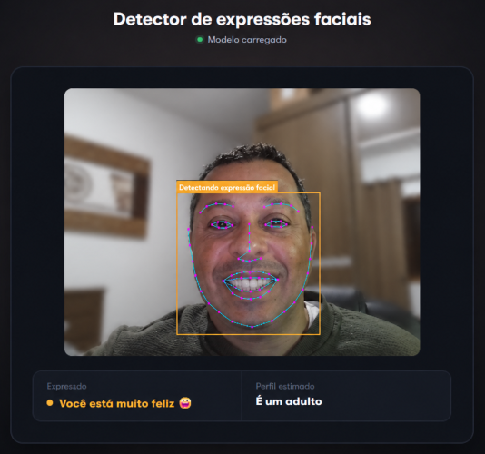

<div align="center">
    
# Detector de Expressões Faciais

</div>

Aplicação web que detecta rostos pela webcam em tempo real e identifica expressão facial, faixa etária e gênero estimados — tudo rodando **inteiramente no navegador**, sem enviar imagem ou dado algum para qualquer servidor.

<!-- Adicione aqui um screenshot ou GIF da aplicação em funcionamento -->
<!--  -->

**Deploy:** <!-- adicione aqui o link do deploy, ex: https://seu-projeto.vercel.app -->

---

## ✨ Funcionalidades

- Detecção facial em tempo real via webcam
- Reconhecimento de expressão (feliz, triste, nervoso, surpreso, com medo, com nojo ou neutro)
- Estimativa de idade e gênero
- Landmarks faciais desenhados sobre o vídeo (contorno de olhos, boca, sobrancelhas etc.)
- Indicador visual (cor/realce) que muda conforme a expressão detectada
- 100% client-side: nenhuma imagem, vídeo ou dado é armazenado ou enviado a um servidor

## 🖥️ Como funciona

A aplicação usa a [face-api.js](https://github.com/justadudewhohacks/face-api.js), uma biblioteca de visão computacional construída sobre o TensorFlow.js, para rodar modelos de detecção facial diretamente no navegador.

No carregamento da página, cinco modelos pré-treinados são baixados de `/public/models` e carregados em memória:

| Modelo | Função |
|---|---|
| `tiny_face_detector` | Localiza rostos no quadro de vídeo |
| `face_landmark_68` | Mapeia os 68 pontos de referência do rosto |
| `face_recognition` | Gera o descritor facial |
| `face_expression` | Classifica a expressão facial |
| `age_gender` | Estima idade e gênero |

A cada segundo, um frame do vídeo da webcam é analisado; os resultados (bounding box, landmarks e classificações) são redesenhados em um `<canvas>` sobreposto ao vídeo.

## 🚀 Tecnologias

- [Next.js](https://nextjs.org/) 12 (Pages Router)
- [React](https://react.dev/) 18
- [face-api.js](https://github.com/justadudewhohacks/face-api.js) — detecção e reconhecimento facial
- [NProgress](https://github.com/rstacruz/nprogress) — barra de carregamento
- CSS Modules — estilização

## 📦 Como rodar localmente

Pré-requisitos: [Node.js](https://nodejs.org/) 16+ instalado.

```bash
# 1. Clone o repositório
git clone https://github.com/marcusguarani/detector-expressoes-faciais-react.git
cd detector-expressoes-faciais-react

# 2. Instale as dependências
npm install
# ou
yarn install

# 3. Rode em ambiente de desenvolvimento
npm run dev
# ou
yarn dev
```

Acesse [http://localhost:3000](http://localhost:3000) e permita o acesso à câmera quando solicitado.

### Outros scripts

```bash
npm run build   # build de produção
npm run start   # sobe o build de produção
npm run lint    # roda o linter
```

## 📁 Estrutura do projeto

```
├── components/
│   └── outros/
│       └── botao.js           # Botão customizado
├── fonts/                     # Fonte GT Walsheim (self-hosted)
├── pages/
│   ├── _app.js                # Layout raiz
│   └── index.js                # Página principal / lógica de detecção
├── public/
│   └── models/                 # Modelos pré-treinados do face-api.js
├── styles/                     # CSS Modules
└── utils/
    └── outros/
        └── emojiAleatorio.js   # Utilitário de emoji aleatório
```

## 🔒 Privacidade

Todo o processamento (detecção facial, classificação de expressão, estimativa de idade/gênero) acontece localmente no navegador do usuário. Nenhuma imagem, vídeo ou dado pessoal é gravado, armazenado ou transmitido para qualquer servidor.

## 👤 Autor

**Marcus Guarani**

[](https://github.com/marcusguarani)
[](https://www.linkedin.com/in/marcusguarani)
[](https://marcusguarani.com.br)

